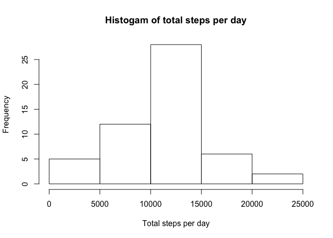
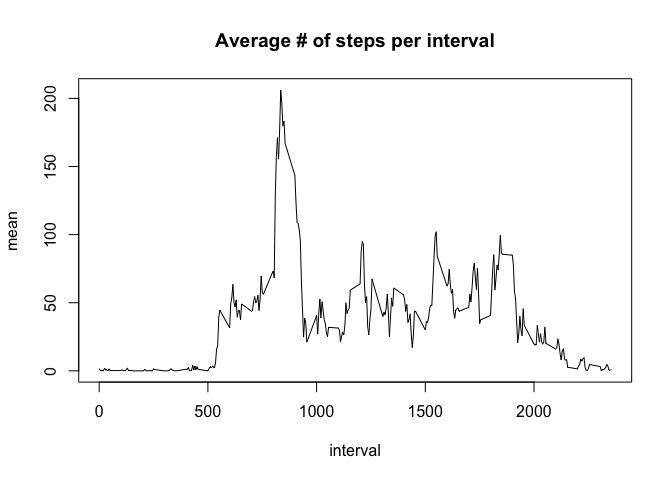
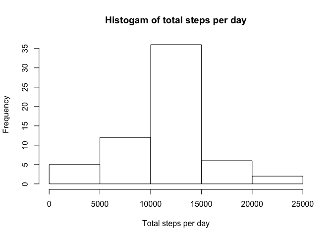
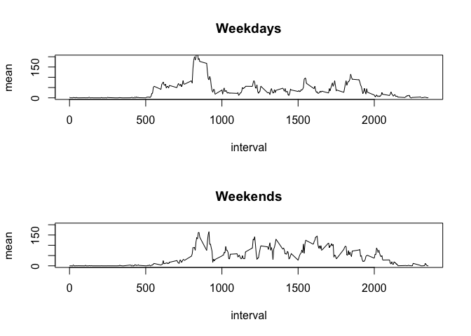

```r
library(dplyr, warn.conflicts = FALSE)
library(ggplot2)
```

The first step is to load and preprocess the data.


```r
temp <- tempfile()
download.file("https://d396qusza40orc.cloudfront.net/repdata%2Fdata%2Factivity.zip", temp)
file <- unzip(temp)
data <- read.csv(file, colClasses = c("numeric", "character", "integer"))
data_complete <- data[complete.cases(data),]
data_nozero <- filter(data, steps > 0)
```

We then create a histogram of the total number of steps taken each day, and calculate the mean and median total number of steps taken per day. 


```r
days <- group_by(data_complete, date)
dailytotal <- as.data.frame(summarize(days, total = sum(steps)))
hist(dailytotal$total, xlab="Total steps per day", main="Histogam of total steps per day")
```

<!-- -->

```r
data_output <- as.data.frame(summarize(days, mean_steps = mean(steps), median_steps = median(steps))) 
print(data_output)
```

```
##          date mean_steps median_steps
## 1  2012-10-02  0.4375000            0
## 2  2012-10-03 39.4166667            0
## 3  2012-10-04 42.0694444            0
## 4  2012-10-05 46.1597222            0
## 5  2012-10-06 53.5416667            0
## 6  2012-10-07 38.2465278            0
## 7  2012-10-09 44.4826389            0
## 8  2012-10-10 34.3750000            0
## 9  2012-10-11 35.7777778            0
## 10 2012-10-12 60.3541667            0
## 11 2012-10-13 43.1458333            0
## 12 2012-10-14 52.4236111            0
## 13 2012-10-15 35.2048611            0
## 14 2012-10-16 52.3750000            0
## 15 2012-10-17 46.7083333            0
## 16 2012-10-18 34.9166667            0
## 17 2012-10-19 41.0729167            0
## 18 2012-10-20 36.0937500            0
## 19 2012-10-21 30.6284722            0
## 20 2012-10-22 46.7361111            0
## 21 2012-10-23 30.9652778            0
## 22 2012-10-24 29.0104167            0
## 23 2012-10-25  8.6527778            0
## 24 2012-10-26 23.5347222            0
## 25 2012-10-27 35.1354167            0
## 26 2012-10-28 39.7847222            0
## 27 2012-10-29 17.4236111            0
## 28 2012-10-30 34.0937500            0
## 29 2012-10-31 53.5208333            0
## 30 2012-11-02 36.8055556            0
## 31 2012-11-03 36.7048611            0
## 32 2012-11-05 36.2465278            0
## 33 2012-11-06 28.9375000            0
## 34 2012-11-07 44.7326389            0
## 35 2012-11-08 11.1770833            0
## 36 2012-11-11 43.7777778            0
## 37 2012-11-12 37.3784722            0
## 38 2012-11-13 25.4722222            0
## 39 2012-11-15  0.1423611            0
## 40 2012-11-16 18.8923611            0
## 41 2012-11-17 49.7881944            0
## 42 2012-11-18 52.4652778            0
## 43 2012-11-19 30.6979167            0
## 44 2012-11-20 15.5277778            0
## 45 2012-11-21 44.3993056            0
## 46 2012-11-22 70.9270833            0
## 47 2012-11-23 73.5902778            0
## 48 2012-11-24 50.2708333            0
## 49 2012-11-25 41.0902778            0
## 50 2012-11-26 38.7569444            0
## 51 2012-11-27 47.3819444            0
## 52 2012-11-28 35.3576389            0
## 53 2012-11-29 24.4687500            0
```

Next we look for the average daily activity pattern. We create a time series plot of the average number of steps taken per 5-minute interval, across all days. 


```r
intervals <- group_by(data_complete, interval)
interval_means <- as.data.frame(summarize(intervals, mean = mean(steps)))
with(interval_means, plot(interval, mean, type="l", main="Average # of steps per interval"))
```

<!-- -->

Then we find the interval with the maximum average number of steps.


```r
interval_means[interval_means$mean == max(interval_means$mean), "interval"]
```

```
## [1] 835
```

Next we want to determine the number of missing values in the steps column.


```r
sum(is.na(data$steps))
```

```
## [1] 2304
```

We will create a new data frame and replace all missing values with the mean value for the interval.


```r
data2 <- data.frame(data)
for(row in 1:nrow(data2)){ 
  if(is.na(data2[row, "steps"])){
    rowinterval <- data2[row, "interval"]
    meansteps <- interval_means[interval_means$interval == rowinterval, "mean"]
    data2[row, "steps"] = meansteps
  }
}
```

Once again we will create a histogram of the total number of steps taken each day, and calculate the mean and median total number of steps taken per day. This time we will use the new data set with missing values replaced by the mean value for the interval.


```r
days2 <- group_by(data2, date)
dailytotal2 <- as.data.frame(summarize(days2, total = sum(steps)))
hist(dailytotal2$total, xlab="Total steps per day", main="Histogam of total steps per day")
```

<!-- -->

```r
data2_output <- as.data.frame(summarize(days2, mean_steps = mean(steps), median_steps = median(steps))) 
print(data2_output)
```

```
##          date mean_steps median_steps
## 1  2012-10-01 37.3825996     34.11321
## 2  2012-10-02  0.4375000      0.00000
## 3  2012-10-03 39.4166667      0.00000
## 4  2012-10-04 42.0694444      0.00000
## 5  2012-10-05 46.1597222      0.00000
## 6  2012-10-06 53.5416667      0.00000
## 7  2012-10-07 38.2465278      0.00000
## 8  2012-10-08 37.3825996     34.11321
## 9  2012-10-09 44.4826389      0.00000
## 10 2012-10-10 34.3750000      0.00000
## 11 2012-10-11 35.7777778      0.00000
## 12 2012-10-12 60.3541667      0.00000
## 13 2012-10-13 43.1458333      0.00000
## 14 2012-10-14 52.4236111      0.00000
## 15 2012-10-15 35.2048611      0.00000
## 16 2012-10-16 52.3750000      0.00000
## 17 2012-10-17 46.7083333      0.00000
## 18 2012-10-18 34.9166667      0.00000
## 19 2012-10-19 41.0729167      0.00000
## 20 2012-10-20 36.0937500      0.00000
## 21 2012-10-21 30.6284722      0.00000
## 22 2012-10-22 46.7361111      0.00000
## 23 2012-10-23 30.9652778      0.00000
## 24 2012-10-24 29.0104167      0.00000
## 25 2012-10-25  8.6527778      0.00000
## 26 2012-10-26 23.5347222      0.00000
## 27 2012-10-27 35.1354167      0.00000
## 28 2012-10-28 39.7847222      0.00000
## 29 2012-10-29 17.4236111      0.00000
## 30 2012-10-30 34.0937500      0.00000
## 31 2012-10-31 53.5208333      0.00000
## 32 2012-11-01 37.3825996     34.11321
## 33 2012-11-02 36.8055556      0.00000
## 34 2012-11-03 36.7048611      0.00000
## 35 2012-11-04 37.3825996     34.11321
## 36 2012-11-05 36.2465278      0.00000
## 37 2012-11-06 28.9375000      0.00000
## 38 2012-11-07 44.7326389      0.00000
## 39 2012-11-08 11.1770833      0.00000
## 40 2012-11-09 37.3825996     34.11321
## 41 2012-11-10 37.3825996     34.11321
## 42 2012-11-11 43.7777778      0.00000
## 43 2012-11-12 37.3784722      0.00000
## 44 2012-11-13 25.4722222      0.00000
## 45 2012-11-14 37.3825996     34.11321
## 46 2012-11-15  0.1423611      0.00000
## 47 2012-11-16 18.8923611      0.00000
## 48 2012-11-17 49.7881944      0.00000
## 49 2012-11-18 52.4652778      0.00000
## 50 2012-11-19 30.6979167      0.00000
## 51 2012-11-20 15.5277778      0.00000
## 52 2012-11-21 44.3993056      0.00000
## 53 2012-11-22 70.9270833      0.00000
## 54 2012-11-23 73.5902778      0.00000
## 55 2012-11-24 50.2708333      0.00000
## 56 2012-11-25 41.0902778      0.00000
## 57 2012-11-26 38.7569444      0.00000
## 58 2012-11-27 47.3819444      0.00000
## 59 2012-11-28 35.3576389      0.00000
## 60 2012-11-29 24.4687500      0.00000
## 61 2012-11-30 37.3825996     34.11321
```

Now we will compare the new data set with the original data set to understand the impact of replacing missing values with the mean value for the interval.


```r
compare <- data.frame(data2_output, stringsAsFactors = FALSE)
names(compare) <- c("date", "new_mean", "new_median")
original_mean <- rep("", 61)
original_median <- rep("", 61)
compare <- cbind(compare, original_mean)
compare <- cbind(compare, original_median)
compare %>% mutate_if(is.factor, as.character) -> compare
for(row in 1:nrow(compare)){
  if(compare[row, "date"] %in% data_output$date){
    compare_date <- compare[row, "date"]
    compare[row, "original_mean"] = round(data_output[data_output$date == compare_date,"mean_steps"], 3)
    compare[row, "original_median"] = round(data_output[data_output$date == compare_date, "median_steps"], 3)
  } else {
    compare[row, "original_mean"] = "---"
    compare[row, "original_median"] = "---"
  }
}
compare$new_mean <- round(compare$new_mean, 3)
compare$new_median <- round(compare$new_median, 3)
print(compare)
```

```
##          date new_mean new_median original_mean original_median
## 1  2012-10-01   37.383     34.113           ---             ---
## 2  2012-10-02    0.438      0.000         0.438               0
## 3  2012-10-03   39.417      0.000        39.417               0
## 4  2012-10-04   42.069      0.000        42.069               0
## 5  2012-10-05   46.160      0.000         46.16               0
## 6  2012-10-06   53.542      0.000        53.542               0
## 7  2012-10-07   38.247      0.000        38.247               0
## 8  2012-10-08   37.383     34.113           ---             ---
## 9  2012-10-09   44.483      0.000        44.483               0
## 10 2012-10-10   34.375      0.000        34.375               0
## 11 2012-10-11   35.778      0.000        35.778               0
## 12 2012-10-12   60.354      0.000        60.354               0
## 13 2012-10-13   43.146      0.000        43.146               0
## 14 2012-10-14   52.424      0.000        52.424               0
## 15 2012-10-15   35.205      0.000        35.205               0
## 16 2012-10-16   52.375      0.000        52.375               0
## 17 2012-10-17   46.708      0.000        46.708               0
## 18 2012-10-18   34.917      0.000        34.917               0
## 19 2012-10-19   41.073      0.000        41.073               0
## 20 2012-10-20   36.094      0.000        36.094               0
## 21 2012-10-21   30.628      0.000        30.628               0
## 22 2012-10-22   46.736      0.000        46.736               0
## 23 2012-10-23   30.965      0.000        30.965               0
## 24 2012-10-24   29.010      0.000         29.01               0
## 25 2012-10-25    8.653      0.000         8.653               0
## 26 2012-10-26   23.535      0.000        23.535               0
## 27 2012-10-27   35.135      0.000        35.135               0
## 28 2012-10-28   39.785      0.000        39.785               0
## 29 2012-10-29   17.424      0.000        17.424               0
## 30 2012-10-30   34.094      0.000        34.094               0
## 31 2012-10-31   53.521      0.000        53.521               0
## 32 2012-11-01   37.383     34.113           ---             ---
## 33 2012-11-02   36.806      0.000        36.806               0
## 34 2012-11-03   36.705      0.000        36.705               0
## 35 2012-11-04   37.383     34.113           ---             ---
## 36 2012-11-05   36.247      0.000        36.247               0
## 37 2012-11-06   28.938      0.000        28.938               0
## 38 2012-11-07   44.733      0.000        44.733               0
## 39 2012-11-08   11.177      0.000        11.177               0
## 40 2012-11-09   37.383     34.113           ---             ---
## 41 2012-11-10   37.383     34.113           ---             ---
## 42 2012-11-11   43.778      0.000        43.778               0
## 43 2012-11-12   37.378      0.000        37.378               0
## 44 2012-11-13   25.472      0.000        25.472               0
## 45 2012-11-14   37.383     34.113           ---             ---
## 46 2012-11-15    0.142      0.000         0.142               0
## 47 2012-11-16   18.892      0.000        18.892               0
## 48 2012-11-17   49.788      0.000        49.788               0
## 49 2012-11-18   52.465      0.000        52.465               0
## 50 2012-11-19   30.698      0.000        30.698               0
## 51 2012-11-20   15.528      0.000        15.528               0
## 52 2012-11-21   44.399      0.000        44.399               0
## 53 2012-11-22   70.927      0.000        70.927               0
## 54 2012-11-23   73.590      0.000         73.59               0
## 55 2012-11-24   50.271      0.000        50.271               0
## 56 2012-11-25   41.090      0.000         41.09               0
## 57 2012-11-26   38.757      0.000        38.757               0
## 58 2012-11-27   47.382      0.000        47.382               0
## 59 2012-11-28   35.358      0.000        35.358               0
## 60 2012-11-29   24.469      0.000        24.469               0
## 61 2012-11-30   37.383     34.113           ---             ---
```

The table demonstrates adding the missing values gives us data for dates that were missing from the original analysis.

Finally we are going to use plots to see if there are differences between weekdays and weekends. 


```r
weekend <- c("Saturday", "Sunday")
weekdays <- c("Monday", "Tuesday", "Wednesday", "Thursday", "Friday")
data2$date <- as.Date(data2$date)
weekdays_df <- filter(data2, weekdays(date) %in% weekdays)
weekend_df <- filter(data2, weekdays(date) %in% weekend)
weekdays_grouped <- group_by(weekdays_df, interval)
weekend_grouped <- group_by(weekend_df, interval)
weekdays_intervals <- as.data.frame(summarize(weekdays_grouped, mean = mean(steps)))
weekend_intervals <- as.data.frame(summarize(weekend_grouped, mean = mean(steps)))
par(mfrow = c(2, 1))
with(weekdays_intervals, plot(interval, mean, type="l", main="Weekdays", ylim=c(0,200)))
with(weekend_intervals, plot(interval, mean, type="l", main="Weekends", ylim=c(0,200)))
```

<!-- -->


